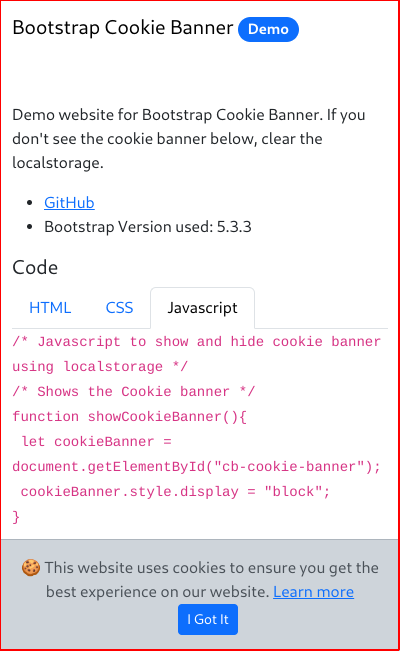
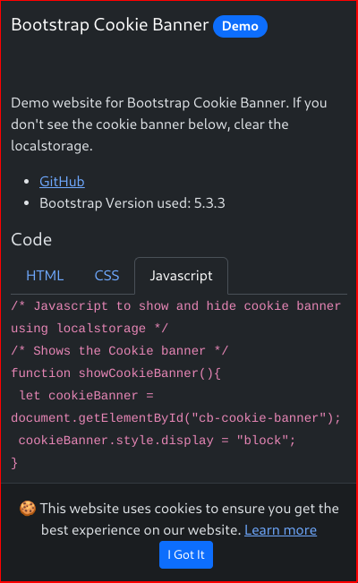

# Bootstrap cookie banner

A cookie banner for websites using Bootstrap 5.

**Demo:** [](https://kolappannathan.github.io/bootstrap-cookie-banner/)

**Bootstrap Version used:** 5.3.3

## Usage

 1. Include the CSS and js files.
 
```html
<!-- Cookie Banner -->
<link rel="stylesheet" href="./src/cookie-banner.css">
<script async src="./src/cookie-banner.js"></script>
```
 2. Minimum HTML to make it work

```html
<!-- Cookie Banner -->
<div id="cb-cookie-banner" class="alert alert-dark text-center mb-0" role="alert">
  &#x1F36A; This website uses cookies to ensure you get the best experience on our website.
  <a href="https://www.cookiesandyou.com/" target="blank">Learn more</a>
  <button type="button" class="btn btn-primary btn-sm ms-3" onclick="window.cb_hideCookieBanner()">
    I Got It
  </button>
</div>
<!-- End of Cookie Banner -->
```

## Screenshot

*Light mode*



*Dark mode*


